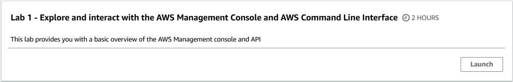
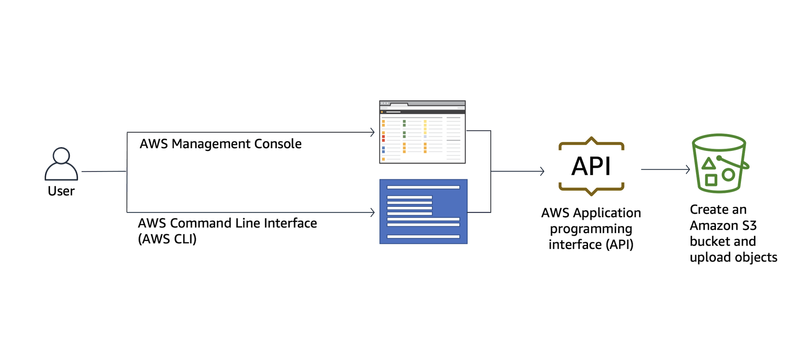
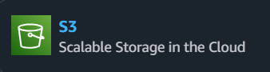
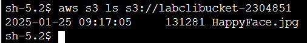

# Lab 01: Exploring and Interacting with the AWS Management Console and CLI


## System Architecture


## Objective
- Explore and interact with the AWS Management Console.
- Create resources using the AWS Management Console. 
- Explore and interact with the AWS CLI.
- Create resources using the AWS CLI.

---

## Overview
This lab focuses on introducing the AWS Management Console and AWS CLI, demonstrating how to create and manage an Amazon S3 bucket using both interfaces.

---

## Steps Taken

### Task 1: Explore the AWS Management Console
1. Selected an AWS Region from the **Region** selector in the black bar and configured the default Region from the user settings by clciking the **Gear** icon.
3. Navigated the AWS Console, added/removing services to/from Favorites, and explored dashboard widgets.

### Task 2: Create an S3 Bucket Using the AWS Console 

1. Navigated to S3 service and created a new bucket: `labbucket-230485`.
2. Configured default settings and verified the bucket creation.

### Task 3: Upload an Object to the S3 Bucket
1. Uploaded `HappyFace.jpg` to the newly created bucket using the AWS Management Console.

### Task 4: Create and Interact with an S3 Bucket Using the AWS CLI
1. Connected to the EC2 Command Host using AWS Systems Manager Session Manager.
2. Ran the following CLI commands:
   
List S3 buckets
  ```bash
   aws s3 ls
```

Create a new bucket
  ```bash
   aws s3 mb s3://labclibucket-2304851
```
   
   Upload an object to the bucket
  ```bash
   aws s3 cp HappyFace.jpg s3://labclibucket-2304851
```
   
   List objects in the bucket
  ```bash
   aws s3 ls s3://labclibucket-2304851
```

3: Verified the uploaded object

