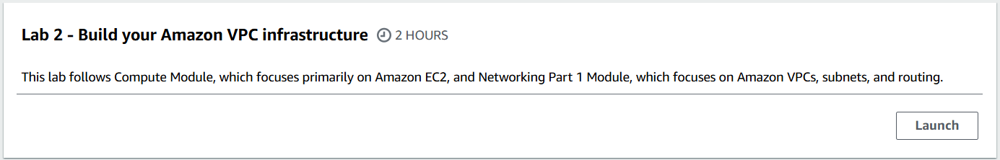
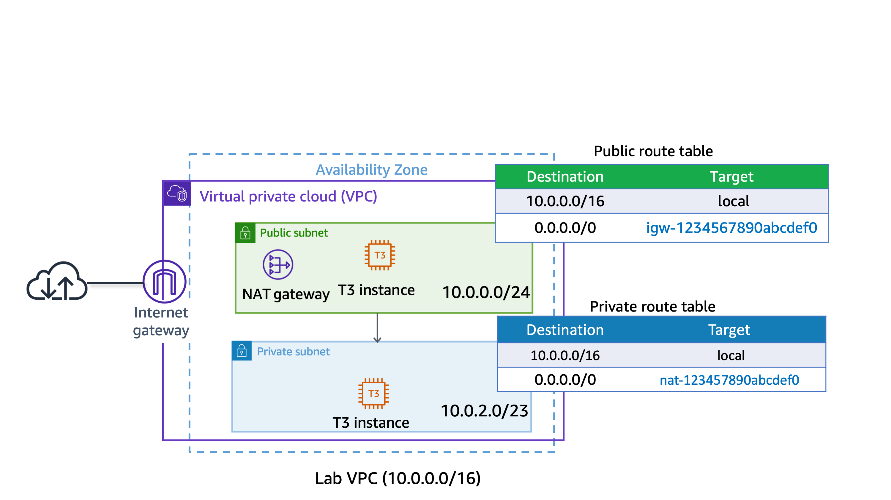
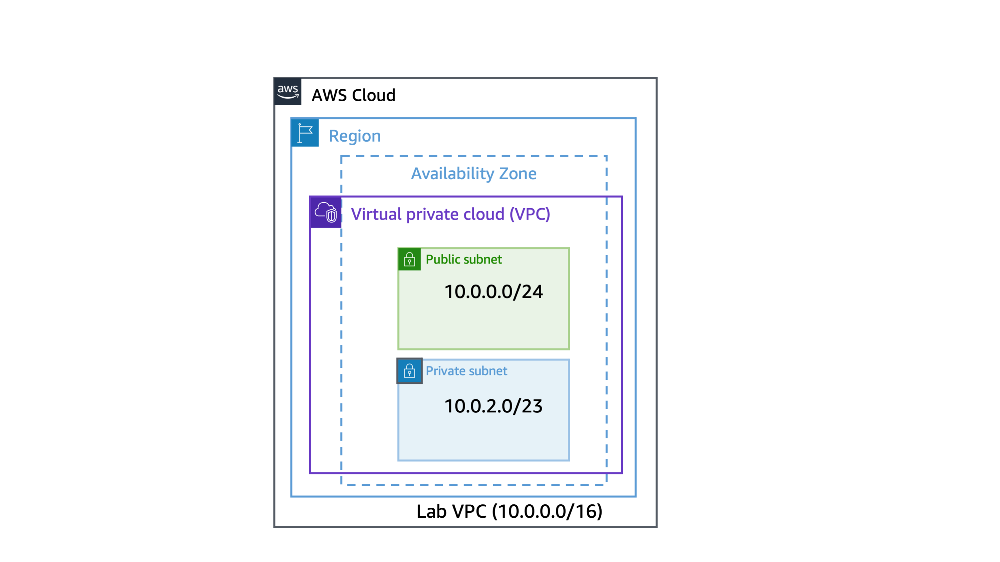
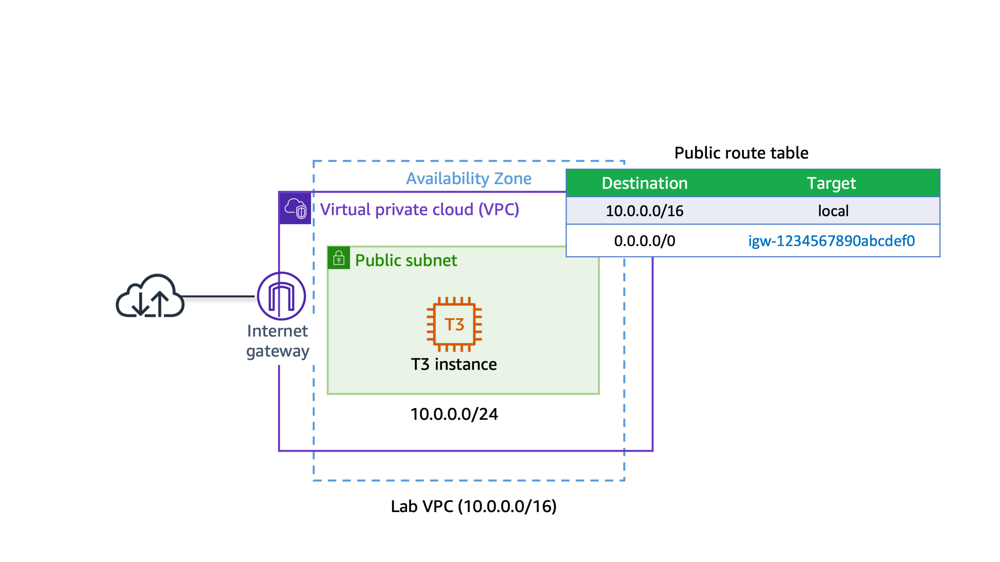

# Lab 2: Building Your Amazon VPC Infrastructure



## Objective
The purpose of this lab was to:
- Build a VPC architecture in AWS with public and private subnets, an internet gateway, and a NAT gateway.
- Launch EC2 instances in public and private subnets.
- Demonstrate an understanding of networking, routing, and security groups.

---

## Architecture Diagram
Below is the architecture I created during this lab:



---

## What I Did

### Step 1: Created an Amazon VPC
1. Navigated to the **VPC Console**.
2. Selected **Create VPC** and configured the following:
   - Name: **Lab VPC**
   - CIDR Block: `10.0.0.0/16`
3. Enabled **DNS hostnames** in the VPC settings to assign DNS names to EC2 instances.
4. Verified that the VPC was in the `Available` state.

---

### Step 2: Created Public and Private Subnets

- **Public Subnet**:
  1. Navigated to **Subnets** in the VPC Console.
  2. Selected **Create Subnet** and configured:
     - Name: **Public Subnet**
     - CIDR Block: `10.0.0.0/24`
     - Enabled **Auto-assign public IPv4 addresses**.
  3. Verified the subnet's state as `Available`.

- **Private Subnet**:
  1. Created a second subnet with the following settings:
     - Name: **Private Subnet**
     - CIDR Block: `10.0.2.0/23`
  2. Left **Auto-assign public IPv4 addresses** disabled (default).

---

### Step 3: Created an Internet Gateway
1. Navigated to **Internet Gateways** in the VPC Console.
2. Selected **Create Internet Gateway** and named it **Lab IGW**.
3. Attached the internet gateway to the **Lab VPC**.

---

### Step 4: Configured Routing for the Public Subnet
1. Created a new route table named **Public Route Table**.
2. Added a route to direct internet-bound traffic (`0.0.0.0/0`) to the internet gateway.
3. Associated the **Public Route Table** with the **Public Subnet**.

---

### Step 5: Created a Public Security Group
1. Navigated to **Security Groups** in the VPC Console.
2. Created a security group named **Public SG** with the following inbound rule:
   - **Type**: HTTP (port 80)
   - **Source**: Anywhere (0.0.0.0/0)
3. Assigned this security group to the public-facing resources.

---

### Step 6: Launched an EC2 Instance in the Public Subnet

1. Navigated to the **EC2 Console** and selected **Launch Instance**.
2. Configured the instance:
   - **AMI**: Amazon Linux 2023
   - **Instance Type**: `t3.micro`
   - **VPC**: Lab VPC
   - **Subnet**: Public Subnet
   - **Security Group**: Public SG
3. Added the following **User Data** to automatically install Apache:
   ```bash
   #!/bin/bash
   yum update -y
   yum install -y httpd
   systemctl enable httpd
   systemctl start httpd
'''
Launched the instance and verified that it was publicly accessible.
 
---

### Step 7: Created a NAT Gateway
1. Navigated to NAT Gateways in the VPC Console.
2. Selected Create NAT Gateway and configured:
   - **Name**: Lab NGW
   - **Subne**t: Public Subnet
   -**Elastic IP**: Allocated a new Elastic IP.
3. Verified that the NAT Gateway was successfully created.

---

### Step 8: Configured Routing for the Private Subnet
1. Created a new route table named Private Route Table.
2. Added a route to direct internet-bound traffic (0.0.0.0/0) to the NAT Gateway.
3. Associated the Private Route Table with the Private Subnet.
   
---

### Step 9: Created a Private Security Group
1. Navigated to Security Groups in the VPC Console.
2. Created a security group named Private SG with the following inbound rule:
   **Type**: HTTP (port 80)
   **Source**: Public SG (reference to the public security group).
3. Assigned this security group to private-facing resources.
   
---

### Step 10: Launched an EC2 Instance in the Private Subnet
1. Launched another EC2 instance in the Private Subnet using the same configuration as the public instance, but with:
2. Security Group: Private SG
3. Auto-assign Public IP: Disabled.
4. Used the same User Data script to configure Apache.
5. Verified that the private instance was accessible from the public instance using its private IP.

---

### Key Learnings

Built a complete VPC with both public and private subnets using the AWS Management Console.
Configured routing tables for internet access via an internet gateway (public) and NAT gateway (private).
Used security groups to control inbound and outbound traffic between public and private resources.
Additional Resources
Amazon VPC Overview
AWS Security Groups
AWS Route Tables

---

### Note

I know from lab01 that all of this is possible using only CLI commands. I plan to run this lab again using only scripting. I need to research the syntax and commands that could make this possible and will publish these commands as Lab-02CLI
