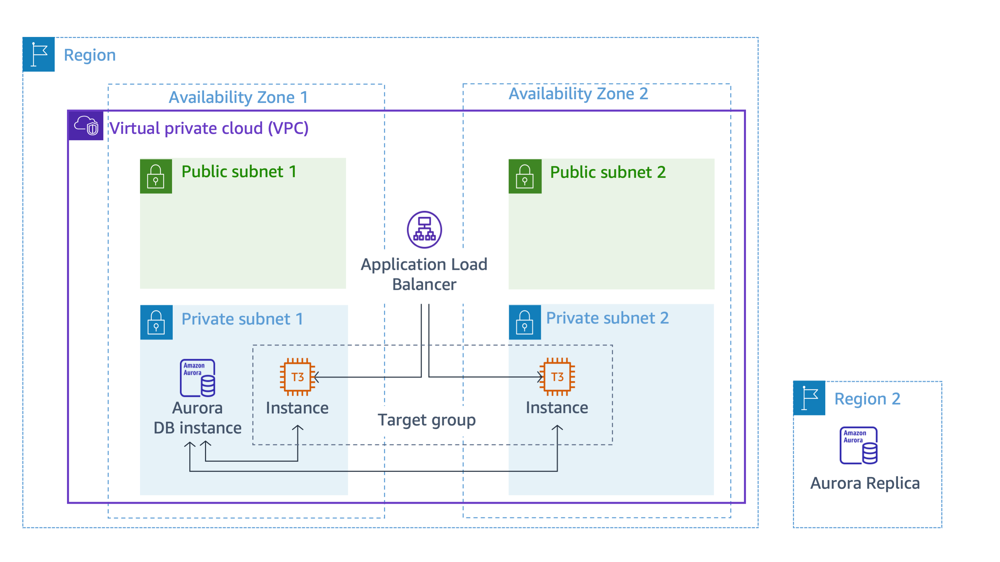
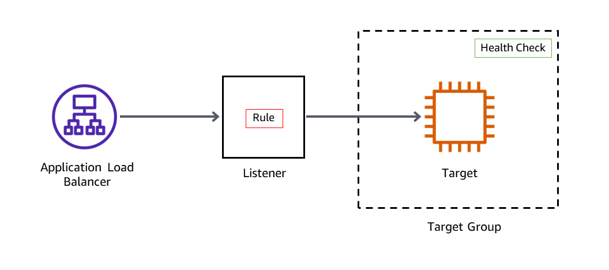

# Lab 3: Creating a Database Layer in Your Amazon VPC Infrastructure

## Objective
The purpose of this lab was to:
- Deploy an **Amazon RDS Aurora database** for MySQL.
- Set up an **Application Load Balancer (ALB)** for front-end traffic distribution.
- Create an **HTTP listener** for the load balancer.
- Register EC2 instances with a **target group**.
- Test **application connectivity** to the database.

---

## Architecture Diagram
Below is the final database layer architecture I implemented:

---

## What I Did

### Step 1: Created an Amazon RDS Database
To establish a managed database layer, I set up an **Aurora DB cluster** for MySQL.

1. Navigated to **RDS > Databases**.
2. Selected **Create Database** and configured:
   - **Engine Type:** `Aurora (MySQL Compatible)`.
   - **DB Identifier:** `aurora`.
   - **Master Username:** `dbadmin`.
   - **Password:** Used the lab-provided password.
   - **Instance Type:** `db.t3.medium`.
   - **Multi-AZ Deployment:** Disabled.
   - **VPC:** Selected `LabVPC`.
   - **Subnet Group:** `labdbsubnetgroup`.
   - **Security Group:** Used `LabDBSecurityGroup`.
   - **Database Name:** `inventory`.
3. Created the database and waited for its **status to become available**.

---

### Step 2: Created an Application Load Balancer
To distribute traffic between the front-end EC2 instances, I deployed an **Application Load Balancer (ALB)**.

1. Navigated to **EC2 > Load Balancers**.
2. Selected **Create Load Balancer** and configured:
   - **Name:** `LabAppALB`.
   - **VPC:** `LabVPC`.
   - **Subnets:** Chose `Public Subnet 1` and `Public Subnet 2`.
   - **Security Group:** `LabALBSecurityGroup`.
   - **Listener Protocol:** `HTTP:80`, routed to `ALBTargetGroup`.
3. Created the load balancer and waited for it to become **active**.

---

### Step 3: Created a Target Group and Registered EC2 Instances
I created a **target group** to allow the ALB to forward requests to the backend instances.

1. Navigated to **EC2 > Target Groups**.
2. Selected **Create Target Group** and configured:
   - **Name:** `ALBTargetGroup`.
   - **Target Type:** `Instances`.
   - **VPC:** `LabVPC`.
3. Registered the EC2 instances:
   - Selected `AppServer1` and `AppServer2`.
   - Included them as **pending targets**.
   - Created the target group.

---

### Step 4: Tested Application Connectivity to the Database
I verified that the database and load balancer were correctly configured.

1. Navigated to **EC2 > Target Groups**.
2. Checked the health status of instances in `ALBTargetGroup` (needed to be **healthy**).
3. Copied the **ALB DNS name** and tested connectivity:
   - Opened a web browser and pasted the **Load Balancer DNS URL**.
   - Ensured the **web application loaded successfully**.
4. Configured the application’s database settings:
   - **Endpoint:** Used the Aurora **writer instance endpoint**.
   - **Database Name:** `inventory`.
   - **Username:** `dbadmin`.
   - **Password:** Used the lab-provided password.
   - Saved and confirmed successful **database connection**.

---

### Step 5 (Optional): Created an RDS Read Replica in Another Region
For **disaster recovery**, I created a **cross-region read replica**.

1. Navigated to **RDS > Databases**.
2. Selected **aurora DB instance** and chose **Create Cross-Region Read Replica**.
3. Configured:
   - **Multi-AZ Deployment:** Disabled.
   - **Region:** Chose the designated `RemoteRegion`.
   - **DB Identifier:** `LabDBreplica`.
   - **VPC:** `LabVPC`.
   - **Security Group:** `LabDBSecurityGroup`.
4. Created the **read replica**.

---

## Key Learnings
- **Load Balancer & Target Groups:** Learned how ALB distributes traffic efficiently.
- **Database Security:** Isolated the database inside a **private subnet** for better security.
- **RDS Connection Details:** Explored **database metadata** to retrieve connection endpoints.
- **Read Replicas:** Understood how they improve **availability and disaster recovery**.

---

## Additional Resources
- [Amazon RDS Overview](https://docs.aws.amazon.com/AmazonRDS/latest/UserGuide/Welcome.html)
- [Application Load Balancer](https://docs.aws.amazon.com/elasticloadbalancing/latest/application/introduction.html)
- [AWS Target Groups](https://docs.aws.amazon.com/elasticloadbalancing/latest/application/load-balancer-target-groups.html)
- [Creating Cross-Region Read Replicas](https://docs.aws.amazon.com/AmazonRDS/latest/UserGuide/USER_ReadRepl.html)

