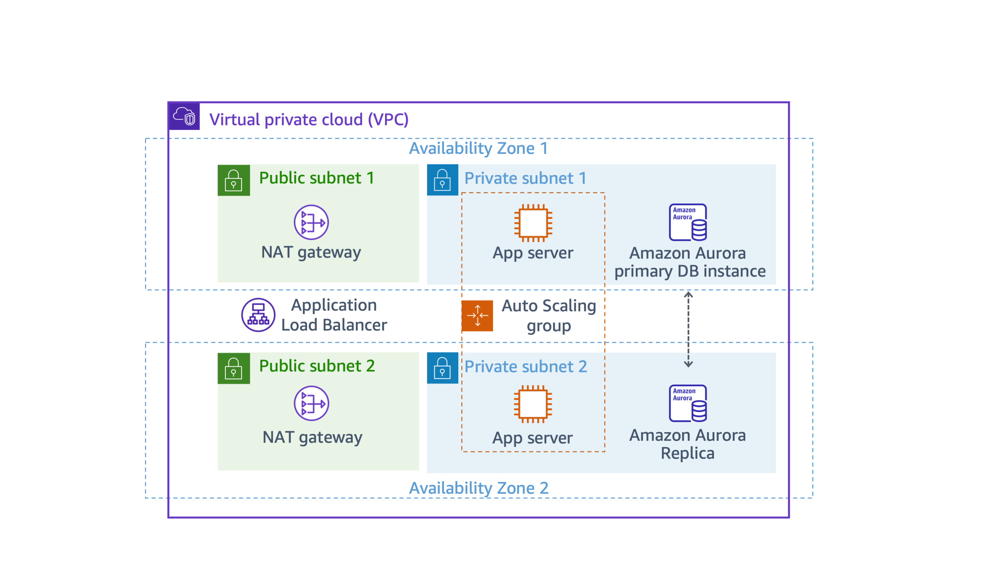

# Lab 4: Configuring High Availability in Your Amazon VPC

## Objective
The purpose of this lab was to:
- Implement **high availability** in an AWS architecture.
- Configure **Elastic Load Balancing** with an **Auto Scaling group** across multiple Availability Zones.
- Create a **highly available Aurora database** and test failover.
- Modify **VPC networking** to ensure redundancy using multiple NAT gateways.

---

## Architecture Diagram
Below is the final high availability architecture I implemented:



---

## What I Did

### Step 1: Inspected the Existing Lab Environment
Before configuring high availability, I reviewed the existing setup, which included:
- A **VPC** with public and private subnets across **two Availability Zones**.
- A **NAT gateway** in one public subnet.
- An **Application Load Balancer (ALB)** already deployed.
- A single **EC2 instance** running an inventory tracking application.
- A **single-instance Aurora database** running in a private subnet.

#### **Key Findings:**
- The **load balancer** was handling incoming traffic, but only had one EC2 instance.
- The **database was not highly available**; it had no read replica or Multi-AZ setup.
- The **NAT gateway was a single point of failure**, with only one deployed.

---

### Step 2: Created a Launch Template for Auto Scaling
To improve availability, I created a **Launch Template** for EC2 instances that will be managed by an Auto Scaling group:

1. Navigated to **EC2 > Launch Templates**.
2. Selected **Create Launch Template** and configured:
   - **Name:** `Lab-template-NUMBER` (with a random number for uniqueness).
   - **AMI:** Amazon Linux 2023 AMI.
   - **Instance Type:** `t3.micro`.
   - **Security Group:** `Inventory-App`.
   - **IAM Role:** `Inventory-App-Role`.
   - **User Data:** Copied from the original instance.
3. Saved the template at version 1.

---

### Step 3: Created an Auto Scaling Group
To maintain availability, I set up an **Auto Scaling Group** to ensure at least two instances are always running.

1. Navigated to **EC2 > Auto Scaling Groups**.
2. Selected **Create Auto Scaling Group** and configured:
   - **Name:** `Inventory-ASG`.
   - **Launch Template:** Used the one created in Step 2.
   - **VPC:** `Lab VPC`.
   - **Subnets:** Selected **Private Subnet 1 & Private Subnet 2**.
   - **Load Balancer:** Attached to `Inventory-App Target Group`.
   - **Desired Capacity:** 2 (min: 2, max: 2).
   - **Health Check Grace Period:** 300 seconds.
3. Verified that two instances were launched and running across **both Availability Zones**.

---

### Step 4: Tested Application Availability
After setting up Auto Scaling, I tested the **high availability** of the application:

1. Opened the inventory application in a browser using the **Load Balancer’s DNS name**.
2. Refreshed multiple times to confirm requests were distributed across **both instances**.
3. **Terminated one EC2 instance manually**.
   - Verified Auto Scaling launched a **replacement instance automatically**.
   - Confirmed the load balancer continued directing traffic to a healthy instance.

---

### Step 5: Configured Multi-AZ Aurora Database
To improve **database availability**, I modified the **Aurora database**:

1. Navigated to **RDS > Databases**.
2. Selected `inventory-cluster` and added a **read replica**:
   - **Instance Name:** `inventory-replica`.
   - **Availability Zone:** Different from the primary.
3. Waited for the replica to reach **Available** state.

#### **Testing Database High Availability**
- Simulated failure by **forcing a failover**:
  1. Selected the **primary Aurora instance**.
  2. Chose **Failover** to promote the read replica.
  3. Verified the **application continued working** after failover.

---

### Step 6: Made NAT Gateways Highly Available
Since a single NAT gateway was a point of failure, I deployed a **second NAT gateway**:

1. Navigated to **VPC > NAT Gateways**.
2. Created a new NAT Gateway in **Public Subnet 2**.
3. Created a new **Route Table** (`Private Route Table 2`) and configured:
   - **Destination:** `0.0.0.0/0`
   - **Target:** The new NAT Gateway.
4. Associated `Private Subnet 2` with `Private Route Table 2`.

#### **Results:**
- Now, if one Availability Zone fails, the other can still access the internet.

---

## Key Learnings
- Successfully **configured high availability** for EC2 instances, database, and networking.
- Learned how **Auto Scaling** ensures application uptime by maintaining minimum instances.
- Understood how **Aurora failover** promotes a read replica for continued database availability.
- Implemented **multi-AZ NAT Gateways** to avoid internet connectivity failures.

---

## Additional Resources
- [Amazon EC2 Auto Scaling](https://docs.aws.amazon.com/autoscaling/ec2/userguide/what-is-amazon-ec2-auto-scaling.html)
- [AWS Elastic Load Balancing](https://docs.aws.amazon.com/elasticloadbalancing/latest/userguide/what-is-load-balancing.html)
- [Aurora High Availability](https://docs.aws.amazon.com/AmazonRDS/latest/AuroraUserGuide/Concepts.AuroraHighAvailability.html)
- [VPC NAT Gateways](https://docs.aws.amazon.com/vpc/latest/userguide/vpc-nat-gateway.html)

```

