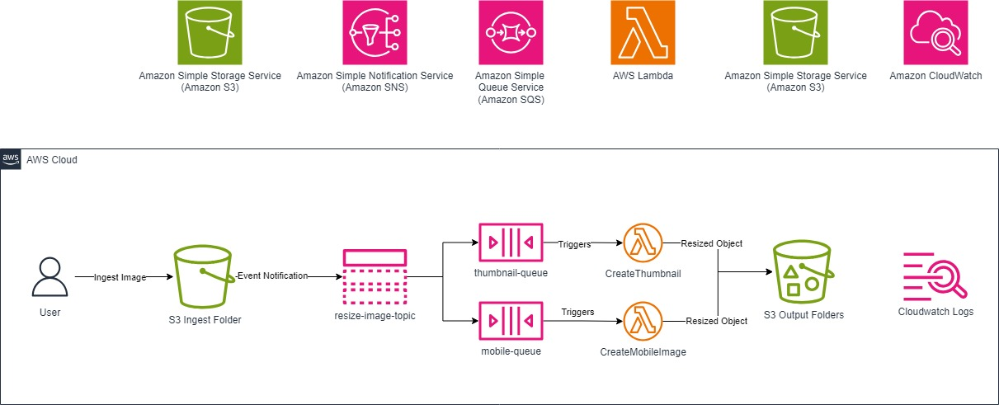

# Lab 5: Building a Serverless Architecture

## Objective

- Create and configure an **Amazon SNS** topic.
- Set up **Amazon SQS** queues and subscribe them to SNS.
- Configure **event notifications** in **Amazon S3**.
- Deploy and configure **AWS Lambda** functions.
- Monitor **AWS Lambda** function executions using **CloudWatch**.

## Overview

This lab focuses on implementing a **serverless architecture** using **Amazon SNS, Amazon SQS, AWS Lambda, and Amazon S3**. The goal is to **automate image processing** by replacing **EC2 instances** with **Lambda functions** to optimize **cost and efficiency**.

---

#### Steps Taken

### Task 1: Create an Amazon SNS Topic

- Navigated to **Amazon SNS** and created a topic named `resize-image-topic-1985`.

  **Details Noted:**
  - **Name:** `resize-image-topic-1985`
  - **ARN:** `arn:aws:sns:eu-west-2:496941116424:resize-image-topic-1985`
  - **Type:** Standard
  - **Topic Owner:** `496941116424`

  **Result:** ✅ SNS topic created successfully.

---

### Task 2: Create Amazon SQS Queues and Subscribe to SNS

- Created an **SQS queue** named `thumbnail-queue` and subscribed it to SNS.
- Created an **SQS queue** named `mobile-queue` and subscribed it to SNS.
- Verified SNS subscriptions by **publishing a test message** and confirming its arrival in both SQS queues.

  **Result:** ✅ Both queues successfully received SNS messages.

---

### Task 3: Create an Amazon S3 Event Notification

- Configured **event notifications** in an **S3 bucket** to trigger SNS when a file is uploaded to the **ingest/** folder.

  **Result:** ✅ SNS topic successfully received the event notification from S3.

---

### Task 4: Create and Configure AWS Lambda Functions

#### Create a Lambda Function for Thumbnail Generation

- Created a **Lambda function** named `CreateThumbnail` with an **SQS trigger** for `thumbnail-queue`.
- Uploaded **deployment package** from S3:
  - `s3://eu-west-2-tcprod/courses/ILT-TF-200-ARCHIT/v7.9.3.prod-1a8066e2/lab-5-Serverless/scripts/CreateThumbnail.zip`
- Configured the **handler** as `CreateThumbnail.handler`.

  **Result:** ✅ Lambda function successfully created and triggered by SQS.

---

#### Create a Lambda Function for Mobile Image Generation

- Created a **Lambda function** named `CreateMobileImage` with an **SQS trigger** for `mobile-queue`.
- Uploaded **deployment package** from S3:
  - `s3://eu-west-2-tcprod/courses/ILT-TF-200-ARCHIT/v7.9.3.prod-1a8066e2/lab-5-Serverless/scripts/CreateMobileImage.zip`
- Configured the **handler** as `CreateMobileImage.handler`.

  **Result:** ✅ Lambda function successfully created and triggered by SQS.

---

### Task 5: Upload an Image to S3 and Trigger Processing

- Uploaded a **test image** (`InputFile.jpg`) to the **ingest/** folder in S3.
- Verified that **SNS triggered the Lambda functions** via SQS.

  **Result:** ✅ Image successfully processed and stored in designated output folders.

---

### Task 6: Validate Processed Files

#### Review CloudWatch Logs

- Checked **AWS Lambda logs** in **CloudWatch** for execution details.
- Verified **successful execution** of Lambda functions.

  **Result:** ✅ Logs confirmed correct function execution with no errors.

---

#### Validate Processed Images in S3

- Navigated to **S3** and verified that **resized images** were successfully created and stored in designated folders.

  **Result:** ✅ Image processing pipeline worked as expected.

---

## Optional Tasks

### Set Up a Lifecycle Rule

- Configured a **lifecycle rule** named `30dayclean` to delete files in the **ingest/** folder **after 30 days**.

  **Result:** ✅ Lifecycle rule successfully applied.

---

### Add an Email Notification to SNS

- Subscribed an **email address** to SNS and confirmed the subscription.
- Proof: Screenshot taken as **evidence of email subscription confirmation**.

  **Result:** ✅ Successfully received SNS email notifications.

---

## Lab Completion Summary

- **Final Status:** ✅ Completed Successfully
- **Time Taken:** _(Insert Duration)_
- **Final Thoughts:** _(Insert Notes on Experience)_

For future reference, see **AWS Training and Certification**.
